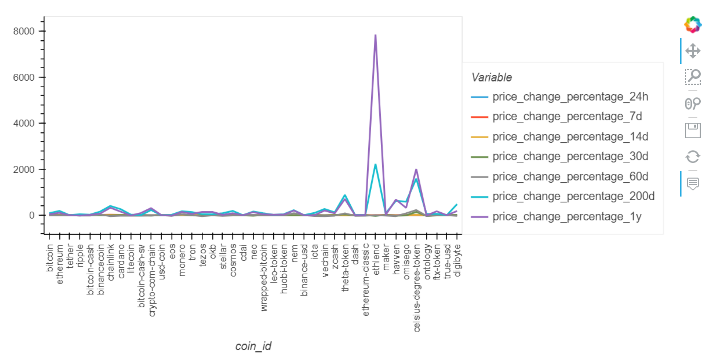
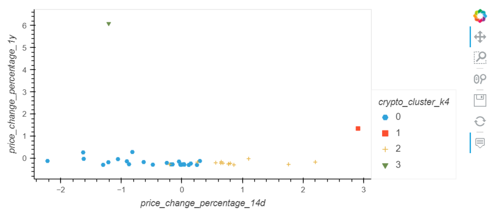
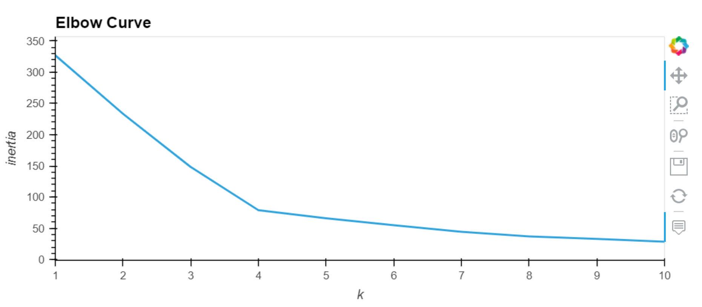

# Crypto-Investment-Unsupervised-Analysis

A Python based approach, using manual and unsupervised analysis on popular cryptocurrencies.

Analysis begins with preparation of the raw data using the StandardScaler module of scikit-learn.

Using a K-means approach, we take the scaled dataframe, fit using a parameter of 4 clusters, run a prediction, and then visualize the results.

In the attempt to find a better cluster methodology, we then create k_model, fit to our dataframe, and produce an elbow curve to best visually demonstrate what is the appropriate value for k.

Further attempting to hone in on the data, we run a Principal Component Analysis, reducing our dataframe into 3 components, determine the amount of variance which may be explained by the PCA, and rerun a K-means analysis using the newfound value for k.

Finally, we end on a visual comparison of scatter plots created using the original parameter of 4 clusters and the number produced by the k_model to determine what difference exists between the graphs and which is the "better" of the two.

---

## Technologies

This analysis runs on python version 3.7, with the following add-ons:

* [scikit-learn](https://scikit-learn.org/stable/index.html) - For standard scaling & clustering analysis by means of K means and Principal Component Analysis.

---

## Installation Guide

Before running the analysis, the following packages must be installed:

*    pip install -U scikit-learn
*    conda install -c pyviz hvplot

---

## Example

For a visual reference as to how the analysis was performed, please refer to the below:

---

## Contributors

Santiago Rosas

